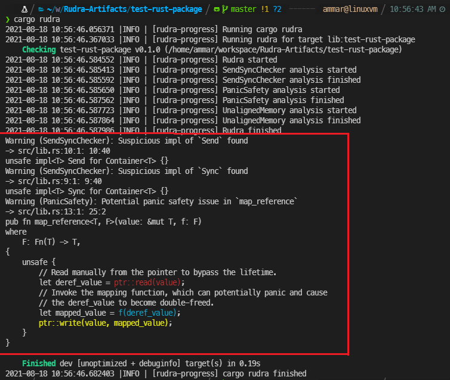

# Artifact Evaluation Submission for RUDRA [SOSP '21]

**Paper**: RUDRA: Finding Memory Safety Bugs in Rust at the Ecosystem Scale


## Overview

Directory structure:

```
📦 Rudra-Artifacts
┣ 📄 paper              (The paper and abstract as accepted to SOSP)
┣ rudra                 (git submodule, source code of Rudra)
┣ rudra-poc             (git submodule, list of bugs found during the research)
┣ 🧪 test-rust-package  (A test package to verify Rudra's basic functionality)
┣ 🖼️ images             (Images used in the README)
```

### Inputs/Outputs

Rudra itself is an analyzer that takes Rust packages (crates) as inputs and
outputs reports from the findings of bug-finding algorithms. As an example,
here is the code of a Rust package containing bugs and a screenshot of Rudra
being run on it, its logs and reports.

#### Input

```rust
use std::ptr;

// A container type that implements Send and Sync for all types, allowing them
// to be sent an used across thread boundaries incorrectly.
pub struct Container<T> {
    pub inner: T,
}

unsafe impl<T> Sync for Container<T> {}
unsafe impl<T> Send for Container<T> {}

// A function that applies a mapping function on a mutable reference.
pub fn map_reference<T, F>(value: &mut T, f: F)
where
    F: Fn(T) -> T,
{
    unsafe {
        // Read manually from the pointer to bypass the lifetime.
        let deref_value = ptr::read(value);
        // Invoke the mapping function, which can potentially panic and cause
        // the deref_value to become double-freed.
        let mapped_value = f(deref_value);
        ptr::write(value, mapped_value);
    }
}
```

#### Output



## Getting Started & Basic Usage

You will need the following to evaluate Rudra:

* [Docker](https://www.docker.com/)
* Python 3
* [Rust Toolchain](https://www.rust-lang.org/tools/install) and [cargo-download](https://crates.io/crates/cargo-download)
* git
* About 40 GB of disk space if running on all crates.io packages.

Download times in steps are based on a gigabit internet connection.

## Installing the Artifact (30 human-minutes + 30 compute-minutes)

This guide describes how to use Rudra with Docker on Linux environment.

1. Install [Docker](https://docs.docker.com/get-docker/) and Python 3 on your system.
1. Run `pip install tomlkit` to install the Python dependency.
1. Install [Rust Toolchain](https://www.rust-lang.org/tools/install).
    * The recommended way is to use rustup.
        * `curl --proto '=https' --tlsv1.2 -sSf https://sh.rustup.rs | sh`
    * You might need to restart your shell, so that `$HOME/.cargo/bin` is in the `$PATH`.
    * Any recent stable version should work since it is only used for `cargo-download`.
1. Install [cargo-download](https://crates.io/crates/cargo-download).
    * Run `cargo install cargo-download` after setting up the Rust toolchain.
    * This command lets us download crates (Rust packages) from Rust's official registry [crates.io](https://crates.io/).
1. Clone [Rudra-Artifact](https://github.com/sslab-gatech/Rudra-Artifacts) and its submodules.
    * `git clone --recursive https://github.com/sslab-gatech/Rudra-Artifacts.git`
    * `rudra` directory includes source code for Rudra and `rudra-poc` lists all of the Rust memory safety bugs found during the research.
    * TODO: we need to include submodules (don't do it until everything is ready)
1. Change into `rudra-poc` directory and clone [RustSec advisory DB](https://github.com/rustsec/advisory-db/).
    * `cd rudra-poc && git clone https://github.com/rustsec/advisory-db.git`
1. Change into `rudra` directory.
    * `cd ../rudra`
1. In Rudra directory, run `docker build . -t rudra:latest`.
1. In Rudra directory, run `./setup_rudra_runner_home_fixed.py <directory>` and set `RUDRA_RUNNER_HOME` environment variable to that directory. This command creates a new directory that is used by Rudra to save configurations and intermediate files.
    * Example: `./setup_rudra_runner_home_fixed.py ~/rudra-home && export RUDRA_RUNNER_HOME=$HOME/rudra-home`
    * Note: DO NOT use `setup_rudra_runner_home.py`. Use `setup_rudra_runner_home_fixed.py` for the artifact evaluation purpose. The fixed version uses a fixed crates.io registry index to reproduce the paper's result.
1. Add `docker-helper` in Rudra repository to `$PATH`. Now you are ready to test Rudra!

## Basic Usability Test: Running Rudra on a single project (5 human-minutes + 1 compute-minutes)

1. Follow the installing the artifact instructions above.
1. From the Rudra-Artifacts directory, run the command `docker-cargo-rudra ./test-rust-package`.
   This will cause the `test-rust-package` folder to be mounted in a docker
   container as a Rust package and then analyzed with Rudra.
1. This should output Rudra's analysis logs and bug reports to stdout,
   reproducing the screenshot from the [*Input/Outputs* section](#output).

## Reproduce Bugs found by Rudra (20 human-minutes + 60 compute-minutes)

All of the new bugs found by Rudra are located in `rudra-poc/poc`.
Each file contains the name of the target crate, version, bug location, issue URL, RustSec/CVE ID,
analysis algorithm that found the bug, and the bug location in toml format in a comment.
See `rudra-poc/README.md` for the full list.
Internal bugs that do not affect the user of the library or the bugs that are independently fixed or already known are located in `rudra-poc/unreported` directory.

Below, *Claims* section shows the claims from different parts of the paper, and
*Validating the Claims* section describes how to validate and reproduce the claims in the paper.

### Claims

#### Abstract

> RUDRA can scan the entire registry
> (43k packages) in 6.5 hours and identified 263 previously
> unknown memory safety bugs—filing 98 RustSec advisories
> and 74 CVEs, representing 41.4% of all bugs reported to
> RustSec since 2016.

Claimed: RUDRA-NEW-BUGS, RUDRA-RUSTSEC-RATIO

#### Figure 1

> RUDRA found 263 new memory safety bugs in the
> Rust ecosystem, representing 41.4% of all RustSec bugs since 2016.

Claimed: RUDRA-NEW-BUGS, RUDRA-RUSTSEC-RATIO

#### 1. Introduction

> It can scan the entire 43k packages in the registry in 6.5 hours and
> found 263 previously unknown memory safety bugs—filing
> 74 CVEs and 98 advisories with the official Rust vulnerability
> database, RustSec [36].

Claimed: RUDRA-NEW-BUGS

> This is an unprecedented number of
> memory safety bugs in the Rust ecosystem: 41.4% and 51.3%
> of the entire RustSec bugs and memory safety bugs since
> 2016 (Figure 1).

Claimed: RUDRA-RUSTSEC-RATIO

> **New bugs.** RUDRA found 263 new memory safety bugs in
> the Rust ecosystem. This represents 41.4% of all bugs in
> RustSec since 2016.

Claimed: RUDRA-NEW-BUGS, RUDRA-RUSTSEC-RATIO

#### Table 2

> The total number of reports with varying precision
> and true bugs after scanning 43k packages (see §6.1).

Claimed: RUDRA-NEW-BUGS, RUDRA-BUG-BREAKDOWN

#### Table 3, Table 4

Claimed: RUDRA-NEW-BUGS

#### 6.1 New Bugs Found by Rudra

> We reported 263 previously unknown memory-safety
> bugs in 145 packages, resulting in 98 RustSec advisories
> and 74 CVEs (see Table 3 and Table 4).

Claimed: RUDRA-NEW-BUGS

> This is an
> unprecedented number of memory-safety bugs, constituting
> 51.3% of all memory-safety bugs in the Rust ecosystem since
> 2016 (see Figure 1).

Claimed: RUDRA-RUSTSEC-RATIO

> During the pilot
> study to identify common bug patterns and while auditing
> code from RUDRA reports, we found 46 additional bugs, resulting
> in 17 RustSec advisories and 25 CVEs, three of which
> are in the Rust standard library [10–12].

Claimed: RUDRA-NEW-BUGS

> **Precision.** (the whole paragraph)

Claimed: RUDRA-BUG-BREAKDOWN

> In total, 98
> RustSec advisories and 74 CVE IDs have been assigned to
> the bugs found by RUDRA. These bugs represent 41.4% of all
> RustSec bugs and 51.3% of memory-safety bugs since RustSec
> started tracking security bugs in 2016.

Claimed: RUDRA-NEW-BUGS, RUDRA-RUTSEC-RATIO

### Validating the Claims

#### RUDRA-NEW-BUGS

`rudra-poc/poc` contains all of the new memory-safety bugs found during the Rudra research.
Although the result can be verified manually from these files,
we provide two scripts that automatically verifies the bug count and reproduces the result for convenience.

##### Verifying the bug count

1. Change into `rudra-poc/paper` directory.
1. Run `./count_bugs.py --simple`.

```
UnsafeDataflow
  Crate: 83, Bugs: 122, RustSec: 41, CVE: 46
SendSyncVariance
  Crate: 63, Bugs: 142, RustSec: 57, CVE: 30
Manual
  Crate: 19, Bugs: 46, RustSec: 17, CVE: 25
```

This script parses the metadata of each file in `rudra-poc/poc` and count the number of bugs
based on the analyzer that detected the bug.

Note that the numbers are slightly different from the submitted version of the paper:
* Current version: 264 new bugs and 78 CVEs
* Paper: 263 new bugs and 76 CVEs

This is because we counted RUDRA-RUSTC-1 bug (see below) as one bug instead of two bugs by mistake,
and two new CVEs were get assigned to the standard library bugs after the submission.
We will use the new numbers in the camera-ready version of the paper.

##### Verifying the reproducibility

1. Change into `rudra-poc/paper` directory.
1. Run `./recreate_bugs.py`.

This script downloads each target package under `rudra-poc/rudra-recreate` directory
and runs `docker-cargo-rudra` command on each of them,
making sure that the bug location is found in Rudra's output.
"Finished running Rudra for (package)" means that Rudra was able to reproduce the bugs know for that package.
This script is multi-threaded,
and our machine with AMD EPYC 7452 (32-core) took 7 minutes for the first run and 2 minutes for the subsequent run.

#### RUDRA-RUTSEC-RATIO

1. Change into `rudra-poc/paper` directory.
1. Run `./rustsec_list_counter.py`.

```
Rudra-found RustSec memory-safety bugs: 96
RustSec total: 232
RustSec memory-safety: 187

RustSec total %: 41.4%
RustSec memory-safety %: 51.3%
```

This script reports the number of bugs reported to RustSec and the ratio of Rudra-found bugs among them.
As we described in the paper, we excluded notices and unmaintained advisories, which do not always represent a bug in the target package.
`rudra-poc/paper/rustsec_list_annotated.csv` is the raw data that shows how we categorized each RustSec report.

#### RUDRA-BUG-BREAKDOWN

1. Change into `rudra-poc/paper` directory.
1. Run `./recreate_bugs.py`.

This scripts runs Rudra on all of the target packages that Rudra found bugs in and ensures Rudra can reproduce them.
The script prints the breakdown of the bug counts in each precision.

```
$ ./recreate_bugs.py
(...)
Bugs count for SendSyncVariance algorithm
High - visible 118 / internal  60
 Med - visible 181 / internal  98
 Low - visible 197 / internal 111
Bugs count for UnsafeDataflow algorithm
High - visible  65 / internal   8
 Med - visible 119 / internal  17
 Low - visible 163 / internal  31
```

```
The numbers reported in the paper:
Bugs count for SendSyncVariance algorithm
High - visible 118 / internal  59
 Med - visible 182 / internal  96
 Low - visible 197 / internal 109
Bugs count for UnsafeDataflow algorithm
High - visible  65 / internal   7
 Med - visible 118 / internal  15
 Low - visible 162 / internal  28
```

Note that the numbers are slightly different from the submitted version of the paper.
This is because we found some uncounted bugs while we are automating the bug counting for the artifact submission.
Rudra can actually find 5 *more* bugs in total than what we reported in the submitted version.
We will use the new numbers in the camera-ready version of the paper.

## Validating Rust standard library bugs (10 human-minutes + 30 compute-minutes)

Analyzing the Rust standard library and compiler is slightly different than a
simple Rust package. We have included a Docker image that will perform all the
steps to do the analysis.

1. Install [Docker](https://docs.docker.com/get-docker/) and set up the `rudra`
   image as explained in the *Installing the Artifact* section above.
1. Change into the `rudra/stdlib-analysis` directory.
1. Build the standard library analysis image with: `docker build -t rudra-std .`
1. Run the analysis on the standard library and pipe the reports into a file:
   `docker run -it rudra-std > rudra-std-report.txt`

The generated `rudra-std-report.txt` file should contain Rudra's output and
reports which can be used to verify the claims about Rust standard library
and compiler bugs identified in the paper.

The next few sections show the claimed bugs from the different parts of the
paper. The final section shows how to correlate them with Rudra's bug reports.

### Claims

#### Abstract

> The new bugs RUDRA found are nontrivial and subtle and often made by Rust
> experts: two in the std library, ... and one in the Rust compiler, rustc.

Claimed: RUDRA-STD-1, RUDRA-STD-2, RUDRA-RUSTC-1

#### 1. Introduction

> these memory safety bugs are subtle and non-trivial, e.g., two in the standard
> library, ... and one in the Rust compiler, rustc, which are the mistakes made
> by Rust experts.

Claimed: RUDRA-STD-1, RUDRA-STD-2, RUDRA-RUSTC-1

#### Figure 3

> An example of a panic safety bug, fix, and PoC in the Rust standard library
> that RUDRA found (CVE-2020-36317).
> It was independently fixed, but the latest stable version was still vulnerable
> when RUDRA discovered it.

Claimed: RUDRA-STD-3 (Independently Fixed)

#### 3.2 Higher-order Safety Invariant

> This bug in the `join()` function for `[Borrow<str>]` was discovered by RUDRA
> in the Rust standard library.

Claimed: RUDRA-STD-1

#### Figure 4

> A missing check of the higher-order invariant introduces a time-of-check to
> time-of-use bug in the Rust standard library (`join()` for `[Borrow<str>]`).
> RUDRA found this previously unknown bug (CVE-2020-36323).

Claimed: RUDRA-STD-1

#### Table 4

> | Package | Location              | ... | Bug ID                    |
> |---------|-----------------------|-----|---------------------------|
> | std     | str.rs <br/> mod.rs   | ... | C20-36323 <br/> C21-28875 |
> | rustc   | worker_local.rs       | ... | rust#81425                |

Claimed: RUDRA-STD-1, RUDRA-STD-2, RUDRA-RUSTC-1

### Correlating with RUDRA's Reports

These are the claimed bugs from the paper above, their descriptions and bug
reports as well as the RUDRA reports that identified them. The reports should
be present in the `rudra-std-report.txt` file generated above.

#### RUDRA-STD-1

```
Info (UnsafeDataflow:/SliceUnchecked): Potential unsafe dataflow issue in `str::join_generic_copy`
-> /usr/local/rustup/toolchains/nightly-2020-08-26-x86_64-unknown-linux-gnu/lib/rustlib/src/rust/library/alloc/src/str.rs:137:1: 182:2
```

`join` on `[Borrow<str>]` can return uninitialized memory if the borrowed
string returns different strings as part of the `Borrow` trait.
[[CVE-2020-36323](https://nvd.nist.gov/vuln/detail/CVE-2020-36323)]
[[rust-lang/rust#80335](https://github.com/rust-lang/rust/issues/80335)]

#### RUDRA-STD-2

```
Error (UnsafeDataflow:/VecSetLen): Potential unsafe dataflow issue in `io::read_to_end_with_reservation`
-> /usr/local/rustup/toolchains/nightly-2020-08-26-x86_64-unknown-linux-gnu/lib/rustlib/src/rust/library/std/src/io/mod.rs:354:1: 399:2
```

A `Read` implementation that returns a bytes read larger than the buffer size,
calling `read_to_end` and `read_to_string` can cause a heap buffer overflow.
[[CVE-2021-28875](https://nvd.nist.gov/vuln/detail/CVE-2021-28875)]
[[rust-lang/rust#80894](https://github.com/rust-lang/rust/issues/80894)]

#### RUDRA-STD-3 (Independently Fixed)

```
Warning (UnsafeDataflow:/CopyFlow): Potential unsafe dataflow issue in `string::String::retain`
-> /usr/local/rustup/toolchains/nightly-2020-08-26-x86_64-unknown-linux-gnu/lib/rustlib/src/rust/library/alloc/src/string.rs:1230:5: 1263:6
```

When `String::retain()` is provided with a filter function `f` that can panic,
the string can end up containing non-UTF-8 encoded bytes. This breaks the
standard library's assumption that strings are UTF-8 encoded and can lead to
memory safety issues.
[[CVE-2020-36317](https://nvd.nist.gov/vuln/detail/CVE-2020-36317)]
[[rust-lang/rust#78498](https://github.com/rust-lang/rust/issues/78498)]

#### RUDRA-RUSTC-1

```
Error (SendSyncVariance:/PhantomSendForSend/NaiveSendForSend/RelaxSend): Suspicious impl of `Send` found
-> rayon-core/src/worker_local.rs:18:1: 18:42
unsafe impl<T> Send for WorkerLocal<T> {}
Warning (SendSyncVariance:/ApiSyncforSync/NaiveSyncForSync/RelaxSync): Suspicious impl of `Sync` found
-> rayon-core/src/worker_local.rs:19:1: 19:42
unsafe impl<T> Sync for WorkerLocal<T> {}
```

The `WorkerLocal` struct used in parallel compilation mode could lead to data
races across threads.
[[rust-lang/rust#81425](https://github.com/rust-lang/rust/issues/81425)]


## Validating Rudra's precision on crates.io Packages (20 human-minutes + 7 compute-hours)

(Computing time is highly dependent on your computing power)

Below, *Claims* section shows the claims from different parts of the paper, and
*Validating the Claims* section describes how to validate and reproduce the claims in the paper.

### Claims

#### Table 2

| Analyzer | Precision | # Reports |
|----------|-----------|-----------|
|          | High      | 138       |
| UD       | Med       | 421       |
|          | Low       | 1215      |
|          | High      | 380       |
| SV       | Med       | 815       |
|          | Low       | 1207      |

Claimed: RUDRA-REPORTS-PRECISION

#### 6.1 New Bugs Found by Rudra

> RUDRA took about 6.5 hours to scan all the packages on our
> machine: 15.7% (7k) did not compile with the rustc version
> RUDRA was based on, 4.6% (2k) did not produce any Rust
> code (e.g., macro-only packages), and 1.8% (0.7k) did not
> have proper metadata (e.g., depending on yanked packages),
> leaving us with 77.9% (33k) packages as analysis targets.

Claimed: RUDRA-COMPILE-RESULT

> **Precision.** (whole section)

Claimed: RUDRA-REPORTS-PRECISION

### Validating the Claims

#### RUDRA-COMPILE-RESULT, RUDRA-REPORTS-PRECISION

1. Unpack `rudra-runner-home-cache.tar.gz` and set `$RUDRA_RUNNER_HOME` environment variable to the unpacked directory.
1. (Optional) Use `docker-rudra-runner` to run the experiment. Otherwise, you can use `campaign/20210816_225417` that includes all logs and reports for convenience.
1. Change into `rudra-poc/paper` directory.
1. Run `./log_analyzer.py` to list the experiments. Then, run `./log_analyzer.py <experiment_id>` to analyze the log.
    * Example: `./log_analyzer.py 20210816_225417`

First, download `rudra-runner-home-cache.tar.gz` from TODO and set `$RUDRA_RUNNER_HOME` environment variable to point the extracted directory.
This file contains downloaded source code of each crate under `rudra_cache`
and full logs and reports of analyzing all crates under `campaign/20210816_225417`.
Step 1 is not strictly necessary for verifying the result but highly recommended
due to the slow rate-limit of crates.io which is 1 req/sec.

You can run Rudra on all crates with `docker-rudra-runner` command.
This command took 6.5 hours on a machine with 32-core AMD EPYC 7452, 252 GB memory, and an NVMe SSD that runs Ubuntu 20.04.
The analysis result will be saved in `$RUDRA_RUNNER_HOME/campaign/YYYYMMDD_HHmmss/[log|report]` directories.
For convenience, we included a full experiment result that was run on our machine under `20210816_225417` directory.

Finally, run `./log_analyzer.py <experiment_id>` to print the final result.
It takes less than 1 minute to analyze the result.

```
$ ./log_analyzer.py 20210816_225417
{<Status.OKAY: 1>: 33223, <Status.EARLY_COMPILE_ERROR: 2>: 6656, <Status.LINT_COMPILE_ERROR: 3>: 3, <Status.EMPTY_TARGET: 4>: 1974, <Status.METADATA_ERROR: 5>: 751, <Status.ONLY_MAC_OS_ERROR: 6>: 18}
Reports for analyzer SendSyncVariance
  On high: 367
  On med: 793
  On low: 1176
Reports for analyzer UnsafeDataflow
  On high: 137
  On med: 434
  On low: 1214
```

Note that the numbers are slightly different from the submitted version of the paper.
It's because (1) Rudra's false positive rate got a little lower because of the updated algorithm (# of report goes down), and (2) we changed a way to count std library reports (# of report goes up).
Overall, the false positive rate got lower than the submitted version.

## Re-using Rudra Beyond the Paper (30 human-minutes)

Rudra's code can be used as an extensible framework for future research for
ecosystem or package level analysis. In particular, Rudra allows new bug finding
algorithms to be integrated easily, taking full advantage of the reporting
mechanism.

The following tutorial guides the user through the creation of a bug finding
algorithm that flags usages of the function `crash_me("please")` across all
Rust code.
